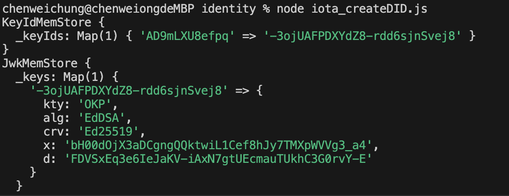

# NMfinal
NM lab final project team 3

## Preparation
### Rust Installation
Please run the following command first. 
```
curl --proto '=https' --tlsv1.2 -sSf https://sh.rustup.rs | sh
. "$HOME/.cargo/env"
```

### Install packages (Identity)
Make sure you have run the command in [Rust Installation](#rust-installation) block above. At the root directory, run the following command:
```
npm install
```

## Identity Creation
First change to `identity/` directory.
```
cd identity
```

### Environment setting
Create an `.env` file (see `.env.example`). 
- `MNEMONIC`: fill a valid mnemonic. (can generate using `mnemonic_generate.js`)
- `STRONGHOLD_PASSWORD`: fill in your stronghold password.

The following two columns are for testing, you can skip it (leave it blank) without having any side effects.
- `DID_EXAMPLE`: fill in one DID (used in `iota_updateDID.js, vc.js`), for example: `did:iota:tst:0xd67066081f03d61307a932ee2e757d2cbdd8a4a79b06eed21f2c9a390cbd04c5` (Don't use mine since you do not have my password! You can resolve it but cannot update it.)
- `DID_EXAMPLE_SUBJECT`: fill in one DID for the subject of VC.

### Run scripts
Simply run following command (modify `***.js` to the scripts you want to run).
``` 
node ***.js
```
**Run following four scripts in order to obtain a DID!**
#### mnemonic_generate.js
Generate a mnemonic (can use to fill the `MNEMONIC` field in `.env`).

#### mnemonic_validate.js
Validate whether `MNEMONIC` in `.env` are valid.

#### stronghold.js
Create stronghold file.

#### iota_createDID.js
Can open a stronghold file, request funds, and create a DID. 

After successfully create a DID, you should remember DID id (starts with `did:iota:tst:` in Published DID document printed in console) and also your JwtKey (printed in JwkIdMemStore `d` column, for example, in the following image, the key is `FDVSxEq3e6IeJaKV-iAxN7gtUEcmauTUkhC3G0rvY-E`) 

You can see `example.txt` for a valid pair of DID and key.


The following three .js are for testing, you can skip it (leave it blank) without having any side effects.
#### resolve.js
Then you can see a new DID has been created and the corresponding DID document is printed. (See `DID_doc_example.txt` for an example.)

#### iota_resolveDID.js
Can resolve a did. (Default resolve DID of `DID_EXAMPLE` in `.env`.)

#### iota_updateDID.js
Can update a did. (Default update DID of `DID_EXAMPLE` in `.env`.)

---
## Run Program
### Run BackendVC
This is for VC related work. First install required packages.
```
cd backendVC
npm install
```
Set `.env` to the following:
```
NODE_ENV="production"
PORT="4000"
```
You can change `PORT` if you want. Then you can run the backend for VC related work.
```
npm start
```

### Run Backend
This is for storing driver-related information.
Open another terminal and switch to `backend` directory. First install required packages.
```
cd backend
npm install
```
Set `.env` to the according to your `MONGO_URL` (We use Mongo DB here, you need to register a account if you do not have one). `PORT` can be any, default to be 5000.
```
PORT=
MONGO_URL=
```
Finally you can start the server
```
npm run server
```

### Run Frontned
Open another terminal and switch to `fronted` directory. First install required packages.
```
cd frontend
npm install
```
Set `.env` to the port you want. (You can also leave it blank, the default port will be open, supposed to be 3000.)
```
REACT_APP_MONGO_PORT=
```
Finally you can start frontend.
```
npm start
```

---
### Reference
- [IOTA-SDK Examples](https://github.com/iotaledger/iota-sdk/tree/develop/bindings/nodejs/examples)
- [Request Funds](https://wiki.iota.org/iota-sdk/how-tos/simple-transaction/request-funds/?language=typescript-node)
- [Create DID](https://wiki.iota.org/identity.rs/how-tos/decentralized-identifiers/create/)

### Note
- According to the [document](https://www.npmjs.com/package/@iota/sdk-wasm), use `@iota/sdk` instead of `@iota/sdk-wasm`, since the former supports stronghold while the other does not.